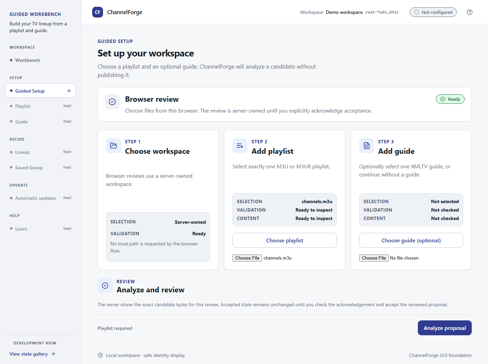
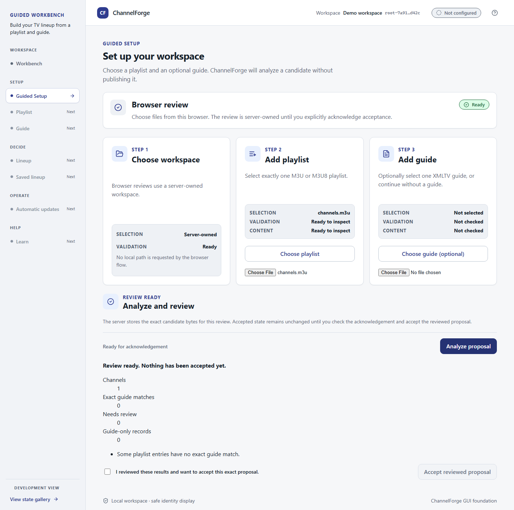
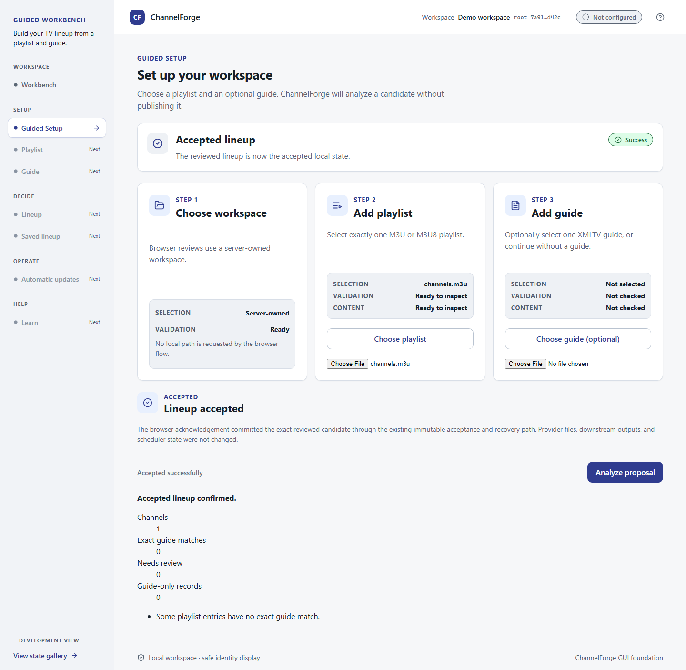

# ChannelForge

<p align="center">

<strong>One source. Many outputs. Zero guesswork.</strong>

</p>

<p align="center">

An evidence-driven television knowledge engine for building accurate, trustworthy, deterministic channel lineups.

</p>

<p align="center">

  

  

  

</p>

---

## What is ChannelForge?

ChannelForge is a PowerShell project that turns provider playlists, guide data, local rules, and reference knowledge into clean television lineups.

It started as tooling for IPTVBoss, Dispatcharr, and Plex, but the bigger goal is this:

> **Establish confidence in television metadata.**

ChannelForge does not blindly trust playlist names.

It verifies, explains, repairs safely, and preserves user intent.

---

## Why it exists

Television metadata changes constantly.

Providers rename channels.

EPG IDs drift.

Logos change.

Duplicate streams appear.

Feeds go down.

Lineups get messy.

ChannelForge is designed to detect that drift, explain what changed, and eventually repair safe issues automatically.

---

## Five pillars

| Pillar | Meaning |

|---|---|

| **Truth** | Important facts should be supported by evidence. |

| **Trust** | Automated decisions should be explainable. |

| **Recoverability** | Changes should be reversible. |

| **Determinism** | Same input, same output. |

| **Self-Healing** | Safe repairs are automated; uncertain repairs require review. |

---

## Current status

> **Early Alpha — not production-ready yet**

Repository publication is complete: the repository is public, protected, and
post-merge `main` CI is green. That does not mean a downloadable product release
is ready. The first release is gated by
[First Usable Alpha readiness](docs/release/FIRST_USABLE_ALPHA.md), tracked in
issue #164, with a target identity of `v0.1.0-alpha.1` only after its
install/start, beginner-workflow, persistence, refresh, packaging, clean-machine,
and exact-head evidence requirements are complete.

Working today:

- PowerShell module layout

- GitHub Actions CI with config schema, Markdown, lint, and test quality gates

- Pester 5.7.1 tests

- Provider config import

- EPG source import

- M3U playlist parsing

- Deterministic merged M3U output from local playlists or configured remote provider M3U sources (alias resolution, numbering, dedup), plus Build-Lineup integration for configured local and bounded remote XMLTV sources with source-aware programme binding/merge and deterministic XMLTV output

- `BuildContext` domain object

- `Channel` domain object

- Channel normalization

- Architecture Decision Records

- Documentation architecture

---

### UI architecture

The primary UI direction is a browser-based local web UI served by the ChannelForge engine. Docker container and Windows server/service installation are the primary deployment modes; native/local development serves the same UI/API. This architecture is recorded in [ADR-0016](docs/adr/0016-web-first-local-ui.md). `scripts/Start-ChannelForgeWebServer.ps1` serves the built React/Vite UI and allowlisted static assets, exposes the read-only `GET /api/status` dashboard, and supports bounded browser Guided Setup review through `POST /api/guided-setup/proposal` plus explicit acknowledgement acceptance through `POST /api/guided-setup/accept`. Browser acceptance reuses the immutable generation publisher, preserves provider/downstream/scheduler state, and exposes only redacted review and acceptance summaries.

Existing React/TypeScript/Tauri work is preserved as reusable layout, design-token, Guided Setup, validation/review, saved-lineup, accessibility, and beginner-copy reference work. Tauri is optional future packaging, not the primary product shell.

### GUI status

| Area                                      | Status                                                                                                                 |
| ----------------------------------------- | ---------------------------------------------------------------------------------------------------------------------- |
| Browser web UI served by engine           | Built UI with read-only `/api/status`, durable browser review sessions, and explicit immutable Guided Setup acceptance |
| Docker deployment                         | Architecture recorded; implementation pending                                                                          |
| Windows server/service install            | Architecture recorded; implementation pending                                                                          |
| Optional Tauri Workbench shell/navigation | Works now (prototype)                                                                                                  |
| Guided Setup layout                       | Browser review and acceptance flow works; native picker/review remains prototype/reference work                        |
| Native file-picker bridge                 | Works now (prototype)                                                                                                  |
| Display-safe selection state              | Works now (prototype)                                                                                                  |
| Pre-parse selection checks                | Works now (prototype)                                                                                                  |
| Playlist structural validation            | Works now — structural only (prototype)                                                                                |
| Guide structural validation               | Works now — structural only (prototype)                                                                                |
| Playlist/guide exact matching             | Implemented — local checks passed (prototype)                                                                          |
| Lineup review                             | Implemented — local checks passed (prototype)                                                                          |
| Saved lineup                              | Implemented — native acceptance + local checks                                                                         |
| Automatic updates                         | Planned / not built yet                                                                                                |

### Browser Guided Setup snapshots







## License

ChannelForge is source-available, not open source. Personal, non-commercial use of official releases is allowed under the ChannelForge Source-Available Personal/Non-Commercial License.

Viewing the code does not grant permission to copy, redistribute, commercialize, host, repackage, or build derivative products or services without prior written permission. See [LICENSE](LICENSE) for the complete terms.

Citing, inspecting, reporting issues, and submitting pull requests are permitted under the license. Commercial use, redistribution, modified-version distribution, bundling, hosting, and derivative products or services require prior written permission.

---

## Engineering foundation

Core project governance and engineering memory:

- [Onboarding](ONBOARDING.md)

- [Constitution](CONSTITUTION.md)

- [AI collaboration](AI_COLLABORATION.md)

- [Claude adapter](CLAUDE.md)

- [Codex adapter](CODEX.md)

- [ChatGPT adapter](CHATGPT.md)

- [Contributing](CONTRIBUTING.md)

- [Documentation](DOCUMENTATION.md)

- [Roadmap](ROADMAP.md)

- [Lessons learned](LESSONS_LEARNED.md)

- [Evidence over assumptions ADR](docs/adr/0005-evidence-over-assumptions.md)

- [ADR template](docs/templates/adr-template.md)

- [Bug sweep checklist](docs/templates/bug-sweep-checklist.md)

- [Vulnerability sweep checklist](docs/templates/vulnerability-sweep-checklist.md)

- [Release checklist](docs/templates/release-checklist.md)

- [Repository docs and user documentation](docs/reference/DOCS_AND_WIKI.md)

---

## Repository map

```text

ChannelForge/

├── data/                  Source data and rules (see *.example.json for local secrets setup)

├── docs/                  Project documentation

│   ├── adr/               Architecture Decision Records

│   ├── architecture/      System design and project identity

│   ├── developer/         Contributor and coding docs

│   ├── engineering/       Engineering standards

│   ├── reference/         Install, security, and reference docs

│   └── user/              Beginner-facing docs

├── schemas/               JSON Schema contracts for data/ config files

├── src/ChannelForge/      PowerShell module

├── tests/                 Pester tests and fixtures

└── README.md
```
