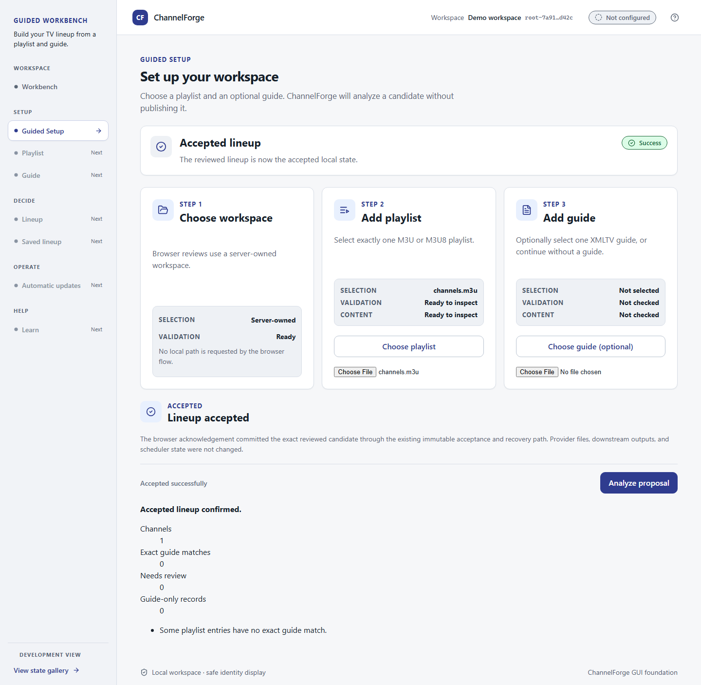

# Current Limitations

This page answers: **what can I actually rely on ChannelForge for today, and what should I not expect yet?**

ChannelForge is **Early Alpha**. Treat everything below as the honest, current state — not a roadmap promise. For what's planned and when, see [ROADMAP.md](../../ROADMAP.md).

## Implemented today

- Parsing real M3U provider playlists.
- Reading provider and EPG source configuration, including local and bounded remote XMLTV acquisition plus remote provider-M3U URL trust-boundary validation.
- Deterministic alias resolution and channel numbering — the same input always produces the same output.
- Merging multiple local or configured remote playlists into one deduplicated `output/merged.m3u`.
- Importing configured local XMLTV `.xml`, `.gz`, and single-entry `.zip` files, plus bounded remote XMLTV plain XML and supported HTTP codings.
- Deterministically merging and exporting validated local or remote XMLTV data to `output/merged.xml`; a failed run leaves that public path absent and quarantines any prior artifact for rollback/inspection only.
- A safe, local-only provider configuration workflow that never requires editing a tracked file (see [Safe Local Configuration](SAFE_LOCAL_CONFIGURATION.md)).
- A build report (`output/reports/build-summary.json`, `lineup-plan.md`) for every run, with a checksum, so you can verify what happened without trusting it blindly.
- A headless/server Guided Setup proposal contract for 1–8 playlists and 0–8 guides, with explicit selected/all guide bindings, no-guide proposals, server-owned staging, authenticated staged-byte hash/length verification, and server-derived source identities. Omitted multi-playlist guide bindings remain enrolled and actionable without being applied; the browser UI remains the legacy one-playlist flow in this slice.
- Browser Guided Setup remains a one-playlist flow with an optional XMLTV upload through `/api/guided-setup/proposal` and `/api/guided-setup/accept`; it requires explicit acknowledgement, reuses immutable accepted-state publication, and leaves provider, downstream, and scheduler state unchanged.
- Durable local source enrollment after browser acceptance, including optional XMLTV, no-guide mode, managed-root integrity checks, restart-safe redacted status, manual review-only refresh, and preservation of accepted lineup state when source refresh fails.
- A Stage A/B/C/D read-only guide-intelligence contract for provider display text, M3U metadata, XMLTV, documented AED-derived evidence, schedule evidence, accepted knowledge, native event-pattern candidates, and beginner review reports. Stage D wires the report-only event-pattern preview into `scripts/Build-My-Lineup.ps1`; it writes deterministic redacted JSON/Markdown/text reports and never publishes a guide or mutates provider, downstream, or accepted state.
- A bounded, read-only One Guide API for Live Now, Starting Soon, fixed categories, and item details. It projects only the verified accepted XMLTV guide, makes no network requests, and does not change saved state. Query results use stable item IDs, safe channel references, and a fixed eight-key taxonomy.
- Existing GUI work is preserved as a reusable React/TypeScript layout, design-token, Guided Setup, validation/review, and saved-lineup reference. Its Tauri wrapper is optional packaging work, not the primary product UI.
- The optional Tauri saved-lineup flow prepares a read-only candidate plan, permits saving only for a native **Checked** match, requires accessible explicit acknowledgement, and navigates to a redacted accepted-state view after native success.

The primary UI architecture is a browser-based local web UI served by the
ChannelForge engine. The current landing UI consumes same-origin
`GET /api/status`. Guided Setup sends browser-selected bytes to
`POST /api/guided-setup/proposal` and requires separate explicit acceptance.

The proposal response is candidate-only: it reports aggregate channel/guide
coverage, an opaque review handle, and fixed safety classifications. It does
not expose raw source values or candidate hashes. A separate acknowledgement
request to `POST /api/guided-setup/accept` commits only the exact server-owned
reviewed candidate through the engine acceptance boundary.
The engine also offers read-only `GET`/`HEAD` routes:
`/api/one-guide/live-now`, `/api/one-guide/starting-soon`,
`/api/one-guide/category/{key}`, and `/api/one-guide/items/{item-id}`.
Responses follow the versioned
[`one-guide-projection.schema.json`](../../schemas/one-guide-projection.schema.json)
contract. The landing UI does not yet show One Guide pages.

One Guide reads only the verified accepted XMLTV artifact. It does not fetch
providers, enumerate current source configuration, or repair accepted state.
Starting Soon means a programme starts after now and within two hours; Live Now
includes its start but excludes its stop. The eight category keys are
`live-now`, `starting-soon`, `wrestling`, `football`, `baseball`, `soccer`,
`movies`, and `news`. Results are paged with `limit` (1–100) and `offset`;
titles and optional metadata are redacted and bounded. The merged accepted
guide does not preserve source identity per programme, so offerings identify
the accepted guide and a safe channel reference. Entitlement, freshness,
confidence, DVR, timeshift, and playback are not available in this slice. The
local server is loopback-only and does not provide authenticated LAN access.



Build and serve it from the repository root:

```powershell
Push-Location .\gui
npm ci
npm run build
Pop-Location
pwsh -File .\scripts\Start-ChannelForgeWebServer.ps1
```

Open `http://127.0.0.1:8765/`. If `gui/dist/index.html` exists, the server
serves that built UI and its allowlisted static assets. Otherwise it serves
the safe placeholder shell. Static requests are read-only, loopback-only,
confined to `gui/dist`, and do not provide directory listings or SPA fallback.
When the status request succeeds, the page says **ChannelForge is running** and
shows whether the lineup is accepted plus a saved-source summary: **Sources
saved**, **Up to date**, **Changes found**, **Needs attention**, or **Source
unavailable**. It also shows playlist and optional-guide status, last checked
time, **Refresh now**, and **Replace sources**. Refresh creates only
review-only evidence and never changes accepted lineup state automatically.

If the server returns `503`, the request fails, or the response shape is
unknown, the page shows a safe unavailable message rather than raw error
details. The UI reads only derived status facts; it does not display provider
data, credentials, private paths, hashes, generation IDs, accepted-generation
contents, or parser details.

Docker container and Windows server/service installation remain future
deployment modes. The alpha Windows x64 portable bundle is implemented without
administrator rights or a Windows service: it uses a pinned runtime, a
loopback-only listener, manifest-verified application files, backup-first
updates, rollback, and explicit uninstall. Browser Guided Setup acceptance does
not publish downstream consumer files, configure a scheduler, or mutate provider
accounts; those are separate future operations. The engine HTTP/API boundary,
not React or a browser-local file path, remains the only authority for
state-changing behavior.

### GUI status

The following describes preserved prototype/reference work, not a primary deployment surface:

| Area                                      | Status                                                                                            |
| ----------------------------------------- | ------------------------------------------------------------------------------------------------- |
| Browser web UI served by engine           | Status dashboard; engine offers read-only One Guide API; Guided Setup acceptance remains explicit |
| Docker deployment                         | Architecture recorded; implementation pending                                                     |
| Windows server/service install            | Future deployment mode; not implemented                                                           |
| Optional Tauri Workbench shell/navigation | Works now (prototype)                                                                             |
| Guided Setup layout                       | Browser review and acceptance works; native picker/review remains prototype/reference work        |
| Native file-picker bridge                 | Works now (prototype)                                                                             |
| Display-safe selection state              | Works now (prototype)                                                                             |
| Pre-parse selection checks                | Works now (prototype)                                                                             |
| Playlist structural validation            | Works now — structural only (prototype)                                                           |
| Guide structural validation               | Works now — structural only (prototype)                                                           |
| Playlist/guide exact matching             | Implemented — local checks passed (prototype)                                                     |
| Lineup review                             | Implemented — local checks passed (prototype)                                                     |
| Saved lineup                              | Implemented — native acceptance + local checks                                                    |
| Automatic updates                         | Planned / not built yet                                                                           |

## Not implemented yet

- **Export, scheduling, release, and tester distribution remain unavailable.** The GUI saved-lineup view reflects native accepted state only; it does not create downstream packages, schedule refreshes, publish to Plex or another target, create releases, or distribute artifacts.
- **Native GUI runtime prerequisites remain local.** The GUI acceptance boundary requires the repository PowerShell workflow and `pwsh`; unavailable or stale native results fail closed without changing accepted state.
- **Remote refresh and browser multi-source UX remain deferred.** Headless v2 proposal enrollment accepts bounded public HTTPS playlist/guide URLs only when they pass the non-tokenized URL trust boundary, acquires them once for candidate analysis, verifies every staged source against its reviewed hash and length before acceptance, and records the descriptor after acceptance. Omitted multi-playlist guide bindings remain actionable but are not applied until explicitly reviewed. It does not provide unattended refresh, retry, auto-accept, or browser multi-row selection. Browser enrollment remains local uploaded M3U and optional XMLTV bytes.
- **Scheduled refresh is opt-in and Windows-only.** The planner remains report-only, while the manual foreground wrapper remains available and defaults to manual mode. Explicit installation creates one owned daily Task Scheduler task per local root; scheduler-owned mode invokes the bounded source-refresh executor once, with deterministic jitter handled by one bounded foreground wait. There is no always-on worker, daemon, service, cron/systemd registration, autonomous retry loop, or cross-platform scheduler backend.
- **No fuzzy or target-specific guide assignment.** The build reports exact, unambiguous M3U `tvg-id` to XMLTV channel-id bindings, plus unbound, ambiguous, and XMLTV-only identities. It does not guess, perform fuzzy matching, or rewrite the separate canonical M3U/XMLTV outputs for a downstream target.
- **No automatic Plex target configuration or refresh.** The generated XMLTV file and exact identity-binding report are separate outputs that downstream Plex configuration must consume explicitly.
- **No automatic Plex refresh.** Re-running the build regenerates `output/merged.m3u`; pointing Plex at the new file or refreshing its channel list is a manual step.
- **The complete event-guide workflow is not implemented yet.** The One Guide read slice provides a safe schedule projection and basic category queries, not a learned event model or full discovery experience. Stage D still provides the report-only event-pattern preview, and Stage E a read-only future-acceptance plan. Volatile statistics, game summaries, standings, and roster/player facts remain omitted or review-only unless freshness, season context, provenance, and contradiction checks prove them current. Neither stage accepts or adopts rules, publishes guides, mutates provider/downstream/accepted state, or creates a learned-rule store. Schedule-source adapters, documented AED-definition JSON import, expert regex/date/time overrides, unattended event refresh, automatic relearning/adoption, beginner GUI integration, and guide publication remain future work.
  Stable title/time/pattern identity remains separate from volatile facts. Stage A/B does not synthesize those facts; Stage E evaluates safe metadata only when a producer supplies it.

## Repository and product release status

The ChannelForge repository is public and its repository-publication gate has
passed. ChannelForge itself remains **Early Alpha** and is not ready for its
first downloadable release.

- `PUBLIC_REPOSITORY_READINESS=PASS`.
- `PUBLIC_RELEASE_STATUS=NOT_RELEASE_READY`.
- GitHub Support ticket `#4764498` is solved: known sensitive commits are not
  reachable from hosted branch or tag tips, and all 61 affected PR diff/code
  surfaces were removed while PR metadata and discussion history were
  preserved.
- The full hosted-ref privacy scan passed with no classified findings.
- GitHub private vulnerability reporting is enabled.
- `Main-Protection` is enforced with required `secret-scan` and
  `quality-gates` checks.
- PR #163 merged and the post-merge public `main` run passed on
  `9879b302709e8d9c72a7c4dd552add5ce031a5f1`.
- Product release readiness is now tracked separately by
  [First Usable Alpha](../release/FIRST_USABLE_ALPHA.md) and issue #164.
- No release, tag, package, or tester build is authorized until that gate is
  complete with exact-head evidence.

## Why these are deferred, not abandoned

ChannelForge's evidence-over-assumptions rule (ADR 0005) keeps the supported remote path bounded and fail-closed. Stale, corrupt, or unvalidated disposable cache data never becomes a successful build. Local and remote XMLTV failures are visible in the build status, the public `merged.xml` path is absent after a non-successful run, and any prior artifact is retained only in the non-published rollback area.

## Where to go next

- Want the engineering-level milestone breakdown? → [ROADMAP.md](../../ROADMAP.md)
- Ready to try what _is_ implemented? → [Build Your First Lineup](Build-Your-First-Lineup.md)
- Hit a problem? → [Troubleshooting](TROUBLESHOOTING.md)
