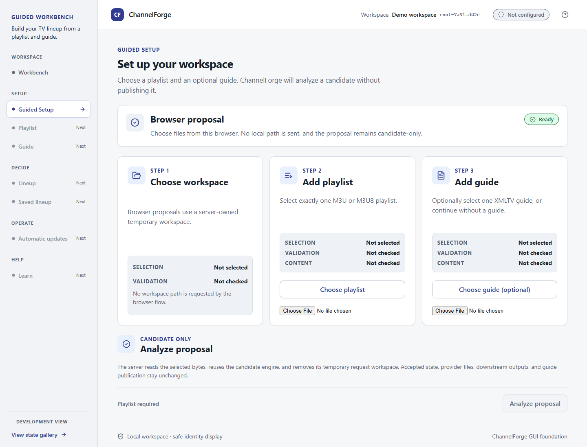

# ChannelForge User Documentation

**One source. Many outputs. Zero guesswork.**

ChannelForge turns provider playlists, guide data, and local rules into a deterministic television lineup. It is currently **Early Alpha — not production-ready**. This is the user-facing guide; for engineering details, architecture, and governance, the [repository README](../../README.md) is always the source of truth.

> This documentation lives in the repository (`docs/user/`) and is versioned and reviewed alongside the code, not published as a separate GitHub Wiki — GitHub Wiki is not available on the current plan. See [DOCUMENTATION.md](../../DOCUMENTATION.md) for why.

## What are you trying to do?

- **I want to understand what ChannelForge is.** → [What Is ChannelForge?](What-Is-ChannelForge.md)
- **I want to build my first lineup.** → [Build Your First Lineup](Build-Your-First-Lineup.md)
- **I want to configure my provider safely.** → [Safe Local Configuration](SAFE_LOCAL_CONFIGURATION.md)
- **I want to use ChannelForge with Plex.** → [Use ChannelForge with Plex](Use-With-Plex.md)
- **I want to troubleshoot a problem.** → [Troubleshooting](TROUBLESHOOTING.md)
- **I want to understand current limitations.** → [Current Limitations](CURRENT_LIMITATIONS.md)

## A first look at browser Guided Setup

Guided Setup lets you choose a playlist and an optional TV guide, then preview
a proposal. Follow the [browser setup walkthrough](Build-Your-First-Lineup.md#browser-guided-setup-proposal)
to build and start the local web UI, select your files, and understand the result.

_Fresh browser capture before selecting files, taken on September 19, 2026. The
demo workspace label is sample content; you do not choose a workspace folder._

The browser flow currently stops at a proposal. It does not save, accept, or
publish a lineup, and it does not change provider accounts or downstream players.

## More

- [Concepts](Concepts/README.md) — the ideas behind ChannelForge, for once the basics work
- [Reference](Reference/README.md) — quick-lookup configuration and command reference
- [Contribute](Contribute.md) — report a problem or get involved

## A note on safety

ChannelForge treats provider URLs, account IDs, and tokens as secrets. Nothing in this documentation will ever ask you to put real provider data into a tracked repository file. Real configuration always lives in an ignored, local-only file on your own machine — see [Safe Local Configuration](SAFE_LOCAL_CONFIGURATION.md) for how.
