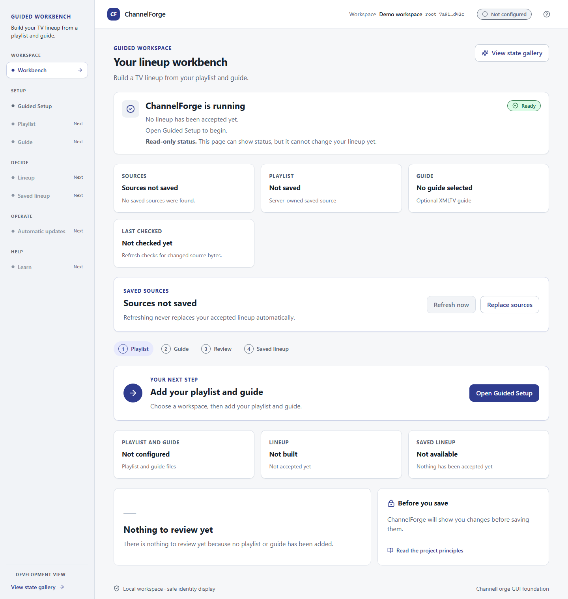
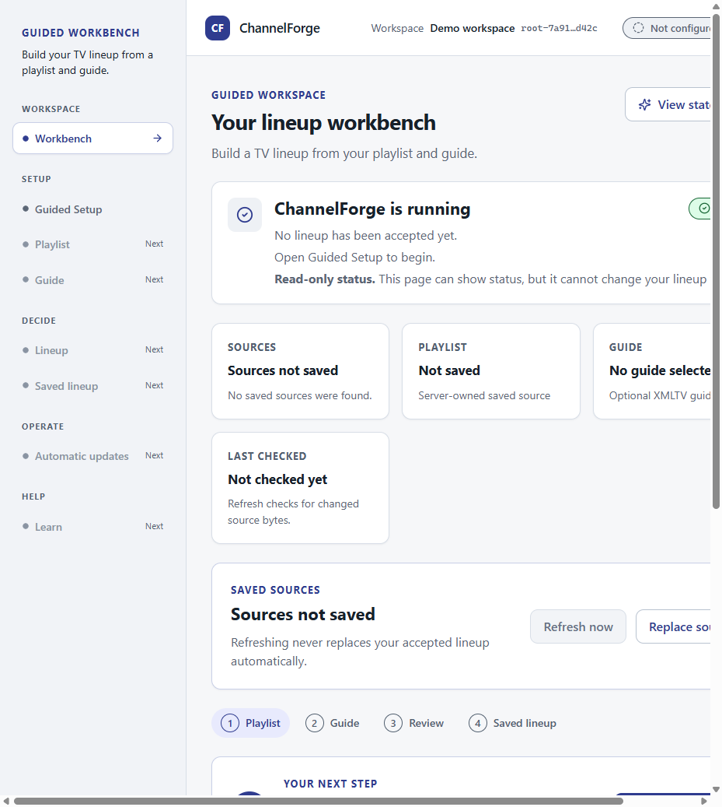

# Install ChannelForge on Windows

ChannelForge alpha 1 is a portable Windows x64 bundle. It does not install a Windows service and does not require administrator rights.

## Install

1. Download `ChannelForge-v0.1.0-alpha.1-windows-x64.zip` from the approved project artifact location.
2. Extract the ZIP to a temporary folder.
3. Double-click **Install ChannelForge.cmd**.
4. The installer copies the verified application to `%LOCALAPPDATA%\ChannelForge` and starts the local server.
5. Confirm that the browser opens `http://127.0.0.1:8765/`.

The bundle includes the official PowerShell `7.6.6` win-x64 portable ZIP
runtime, pinned by its release-archive SHA256 in `package-manifest.json`. The
launcher uses loopback only and stores runtime logs under
`%LOCALAPPDATA%\ChannelForge\state\runtime`.

## First run

Use the guided setup screen to select the provider source, configure guide access, validate the setup, and accept the generated restart plan. Then use **Refresh now** to create the first lineup.

Do not place secrets in the extracted ZIP or commit provider files. Follow [SECURITY.md](../reference/SECURITY.md) for local provider-file rules.

