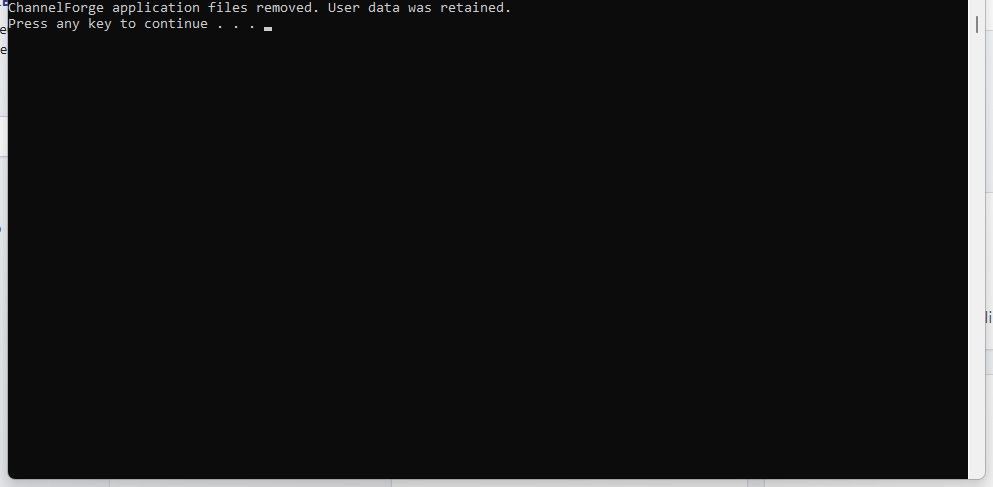

# Uninstall ChannelForge on Windows

The portable bundle has no Windows service and no registry installer entry. Uninstall is performed from the bundle command file.

## Remove application files and keep data

1. Close the ChannelForge browser tab.
2. Double-click **Uninstall ChannelForge.cmd**.
3. The command stops the loopback server and removes application files from `%LOCALAPPDATA%\ChannelForge`.
4. Provider configuration, state, lineup output, caches, logs, and update backups remain for a later reinstall.

## Permanently remove application and user data

Run the bundled PowerShell command only when permanent deletion is intended. The command can be launched from the installed folder; the script relays itself outside the install root before removing the bundled runtime:

```powershell
$pw = Join-Path $env:LOCALAPPDATA 'ChannelForge\\runtime\\pwsh\\pwsh.exe'
& $pw -NoLogo -NoProfile -NonInteractive -ExecutionPolicy Bypass -File (Join-Path $env:LOCALAPPDATA 'ChannelForge\\scripts\\Uninstall-ChannelForgeWindowsBundle.ps1') -InstallRoot (Join-Path $env:LOCALAPPDATA 'ChannelForge') -PurgeData -ConfirmPurge
```

`-PurgeData` without `-ConfirmPurge` is rejected. The purge removes only ChannelForge-owned data directories; it does not delete arbitrary neighboring files.


