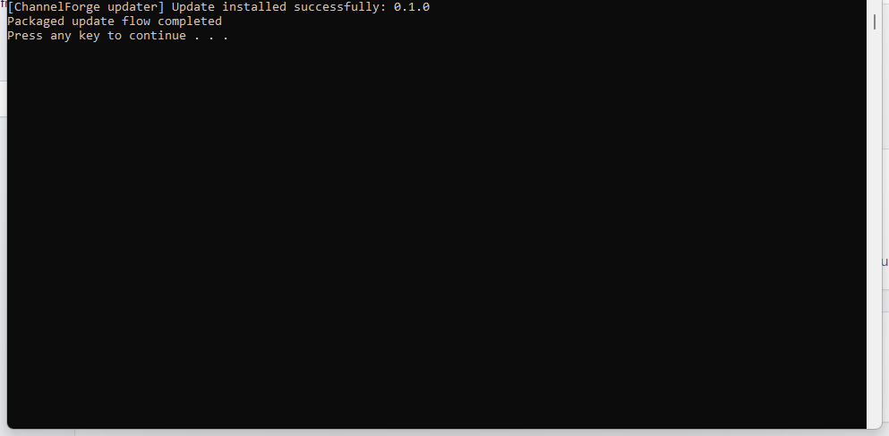

# Update ChannelForge on Windows

Updates are explicit and backup-first. The updater replaces application files
and adds the two required ChannelForge analysis-data defaults only when
absent. It never overwrites existing files under `data`, provider configuration,
state, lineup output, caches, logs, or prior update backups.

## Update from a new bundle

1. Stop active ChannelForge work and keep the current browser tab open.
2. Extract the new approved ZIP.
3. Double-click **Update ChannelForge.cmd** in the extracted bundle.
4. The updater verifies `package-manifest.json`, creates an `UpdateBackups` backup, stops the local server, replaces the immutable application files, validates the installed files, and restarts the server.
5. Confirm the browser still opens `http://127.0.0.1:8765/` and run a read-only status check before refreshing.

If validation or startup fails, the updater restores the backup and attempts to start the previous application. Inspect `%LOCALAPPDATA%\ChannelForge\state\runtime\server.stderr.log` if the browser does not open.

